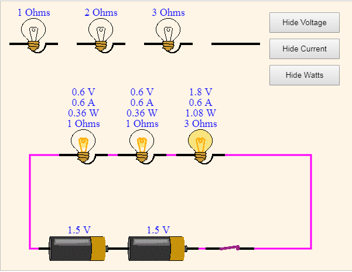
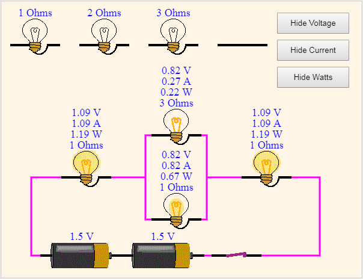

# Simple circuit simulation using JavaScript
##### You can test this circuit simulation [here](https://jhpark16.github.io/SimpleCircuitSimulation/).

This is a simple circuit simulation designed for science classes using JavaScript and HTML5. To accommodate a wide range of students including Primary school students, a very simple user interface was used. You can modify the circuit by dragging and dropping the bulb or the wire, or toggling the switch. For example, you can drag the bulb or the wire above the series circuit and replace the bulb in the circuit or you can remove the bulb in the circuit by dragging it out. You can turn the switch on or off by clicking the switch. The battery cannot be changed. If you want to see, the voltage(V), current(A), and wattage(W), you can click the button to show the information. For simplicity, the resistance of the light bulb is assumed to be invariant regardless of power consumption. In reality, the resistance varies by the power consumption.
This circuit simulation is also designed for mobile devices and can be controlled using touch interface. For a reliable operation inside the circuit simulation box, multi-touch is disabled inside the box. If you want to zoom in or out, you need to use the finger jesture outside the simulation box. This code was originally written as a Java Applet for a web page in 1998. However, most web browsers have droppped supports the NPAPI plugin architecture in 2018, and therefore no longer supports Java Applet technology. To make the code work again with a web browser, it was converted from Java to JavaScript and HTML5 tags. 
## Series Circuit
This is a demonstration of a simple series circuit. You can create a series circuit with a combination of 1, 2, 3 ohm resistors and a wire. The light generated by the light bulb is proportional to the power consumption. If you replace two bulbs with a wire and use 1 ohm light bulb, the maximum brightness (9 Watt) can be obtained. If you replace all light bulbs with 3 ohm light bulbs, you will get the lowest brightness (0.33 Watt).

## Parallel Circuit
This is a demonstration of a simple parallel circuit. The behaviour of parallel circuits are not always easy to predict. For example, if you replace a 1 ohm light bulb of the parallel part of the circuit with a 3 ohm light bulb, the power consumption of the other light bulb of the parallel circuit will increase. 

